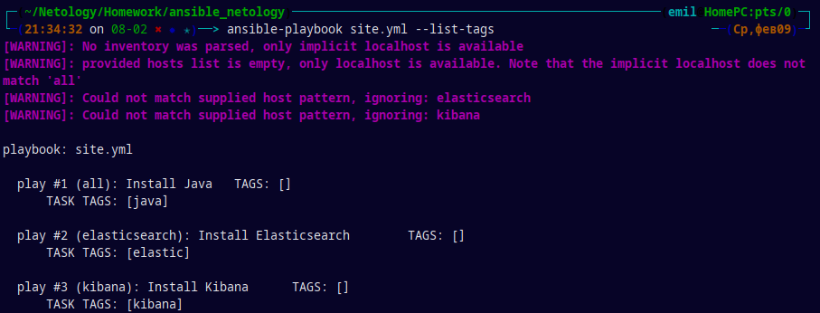
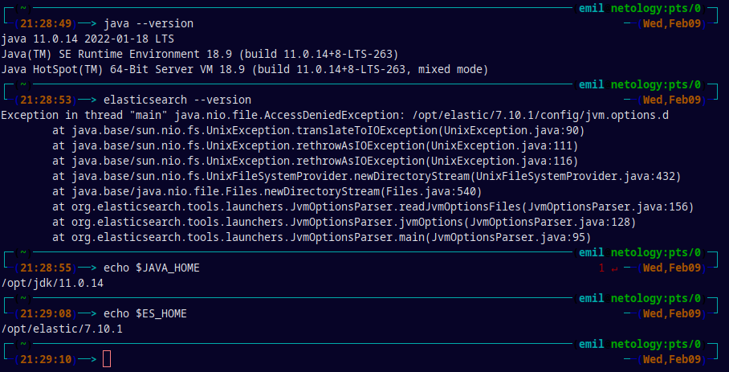
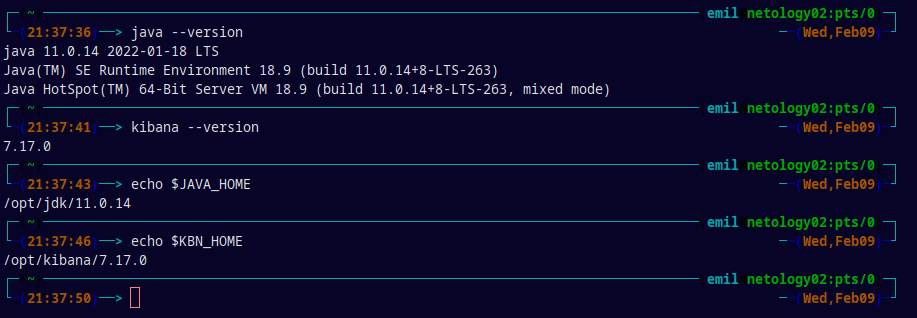

<h3>Установка Java, Elasticsearch, Kibana</h3>

Данный плейбук выполняет установку Java, Elasticsearch, Kibana на две ноды.
Плейбук состоит из трех ***Play***:
  1. Установка Java 11.0.14 на всех хостах:
    * Определение переменной `java_home` содержащей версию устанавливаемой Java из файла `group_vars/all/vars.yml` - `java_jdk_version`
    * Загрузка архива, указанного в переменной `java_oracle_jdk_package` файла `group_vars/all/vars.yml`  с `control node` из деректории `files` на `managed node` по указанному пути;
    * Проверка наличия каталога установки и создание всех отсутствующих каталогов по пути `java_home` - определенной в первой таске;
    * Установка необходимых пакетов, в моем случае установка пакета `tar`
    * Разархивирование архива на `managed node` в директорию установки Java - `java_home`
    * Создания переменных окружения на основе шаблона `templates/jdk.sh.j2`

  2. Установка Elasticsearch на хосты из группы `elasticsearch`:
    * Скачивание архива `Elasticsearch` с версией указанной в `group_vars/elasticsearch/vars.yml` в переменной `elastic_version `непосредственно на `managed node` с правами доступа файловой системы `0755`; Выполняется всегда, независимо от наличия файла на `managed node`;
    * Проверка наличия каталога установки и создание всех отсутствующих каталогов по пути `elastic_home` - определенного в `group_vars/elasticsearch/vars.yml`;
    *  Разархивирование архива на `managed node` в директорию установки Elasticsearch - `elastic_home`;
    * Создания переменных окружения на основе шаблона `templates/elk.sh.j2`

3. Установка Kibana на хосты из группы `kibana`:
    * Скачивание архива `Kibana` с версией указанной в `group_vars/kibana/vars.yml` в переменной `kibana_version` непосредственно на `managed node` с правами доступа файловой системы `0755`. Выполняется всегда, независимо от наличия файла на `managed node`;
    * Проверка наличия каталога установки и создание всех отсутствующих каталогов по пути `kibana_home` - определенного в `group_vars/kibana/vars.yml`;
    *  Разархивирование архива на `managed node` в директорию установки Kibana - `kibana_home`;
    * Создания переменных окружения на основе шаблона `templates/kbn.sh.j2`

<h5>Тэги</h5>

<h5>Версия Java, Elasticsearch на ноде `elasticsearch`</h5>

<h5>Версия Java, kibana на ноде `kibana`</h5>

