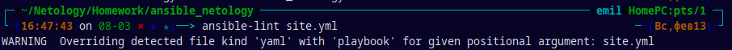
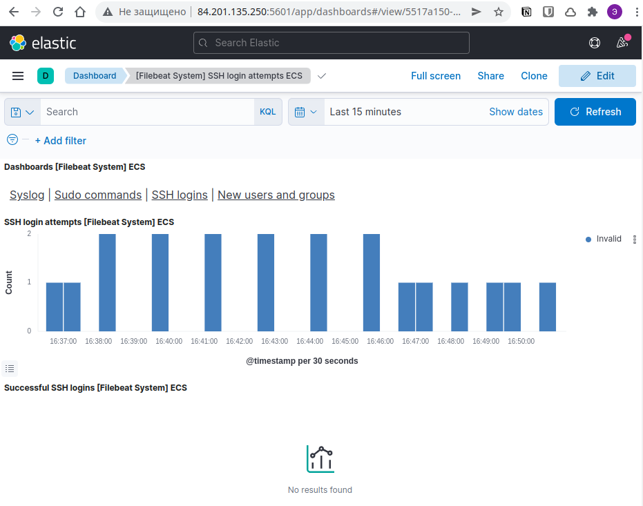

<h3>Установка Elasticsearch, Kibana, Filebeat и загрузка системных логов</h3>

Данный плейбук выполняет установку Elasticsearch, Kibana, Filebeat на 3 отдельные ноды.
<h5>Plays:</h5>

1. Установка Elasticsearch на хосты `elasticsearch`:
    * Скачивание RPM файла;
    * Установка Elasticsearch из RPM с применением модуля `yum`;
    * Копирование заранне подготовленого шаблона конфигурации `templates/elasticsearch.yml.j2` в каталог `/etc/elasticserch` на `manage node`; 
    
2. Уствновка Kibana на хосты `kibana`:
    * Скачивание RPM файла;
    * Установка Kibana из RPM с применением модуля `yum`;
    * Копирование заранне подготовленого шаблона конфигурации `templates/kibana.yml.j2` в каталог `/etc/kibana` на `manage node`; 

3. Уствновка Filebeat на хосты `filebeat`:
    * Скачивание RPM файла;
    * Установка Filebeat из RPM с применением модуля `yum`;
    * Копирование заранне подготовленого шаблона конфигурации `templates/filebeat.yml.j2` в каталог `/etc/filebeat` на `manage node`; 
    * Запуск `filebeat` на `manage node` с применением модуля `command`, если вывод `filebeat_modules.stdout` не равен `"Module system is alredy enabled"`;
    * Запуск дашборов `filebeat` игнорирую статус выполнения для сохранения идемпотентности; 

<h5>ansible-lint</h5>

<h5>Kibana dashboard</h5>

